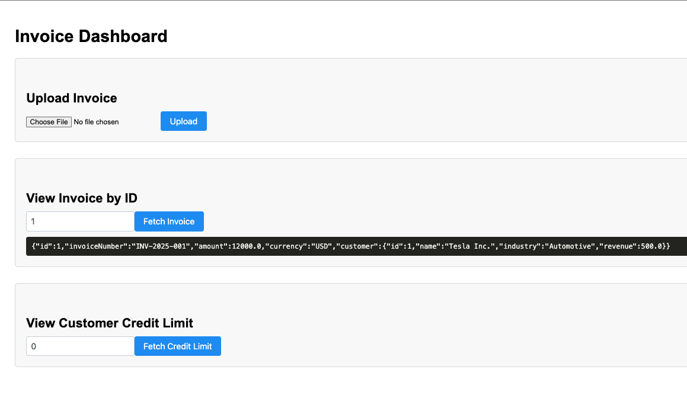

# B2B Credit Risk Recommendation System

## 🔹 Day 1: Backend Core + DB + File Parsing

### ✅ Features Implemented:
- Set up Maven project with Hibernate + MySQL
- Created entity models: `Customer`, `Invoice`
- Configured `persistence.xml`
- Built DAO layer (`InvoiceDAO`, `InvoiceImporter`)
- Parsed XML/JSON files and inserted into DB
- Wrote and passed JUnit tests

### 🛠️ Technologies:
- Java 8, Hibernate (JPA), MySQL, Maven
- XML (DOM), JSON (`org.json`)
- JUnit 4

---

## 🔹 Day 2: REST API + DAO Verification

### ✅ Features Implemented:
- `GET /api/invoice/{id}` – Fetch invoice with customer
- `POST /api/invoice/upload` – Upload invoice file
- `GET /api/customer/{id}/limit` – Return credit limit

### 🔎 Verified Using:
- `curl` + Tomcat logs
- Hibernate DB entries
- WAR deploy to Tomcat 9

### 🛠️ Technologies:
- Jersey (JAX-RS), JSON/XML annotations
- Hibernate, MySQL, Maven

---

## 🔹 Day 3: JSF + PrimeFaces UI Dashboard

### ✅ Features Implemented:
- Upload invoice via JSF form (`FileUploadBean`)
- View invoice by ID (`InvoiceViewerBean`)
- View customer credit limit (`CreditLimitViewerBean`)
- Pretty JSON output and styled UI sections

### 🛠️ Technologies:
- JSF 2.2 (Mojarra), PrimeFaces 11
- ManagedBeans, `HttpURLConnection`
- XHTML, basic CSS

---

### Screenshot

